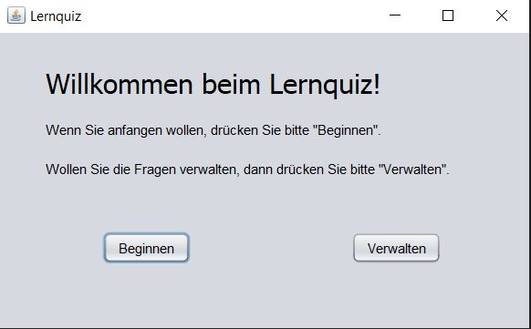
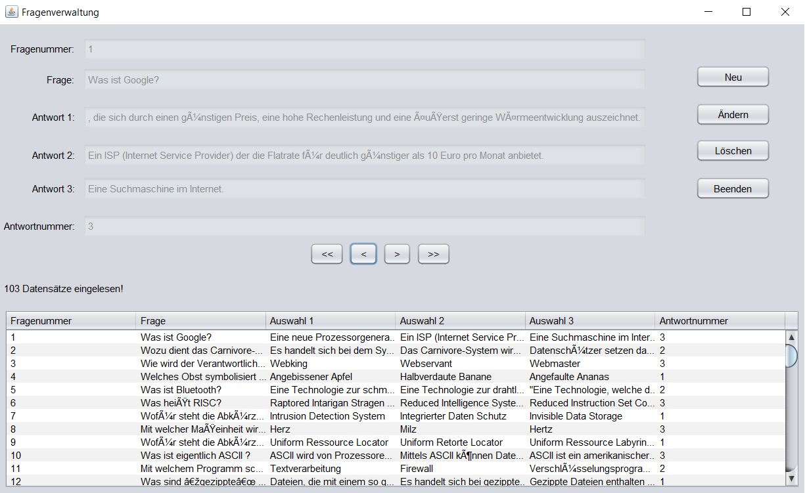

<h1 align="center" style="margin-top: 0px;">*** Lernquiz ***</h1>

## Description

A desktop app I created to learn IT questions.

## Run

-> Download the "Ready Program" folder and execute the Quiz.jar 
-> You will be asked to select the 04quizfragen.csv 
-> You can edit, delete and add new Question with the build-in question-manager 

